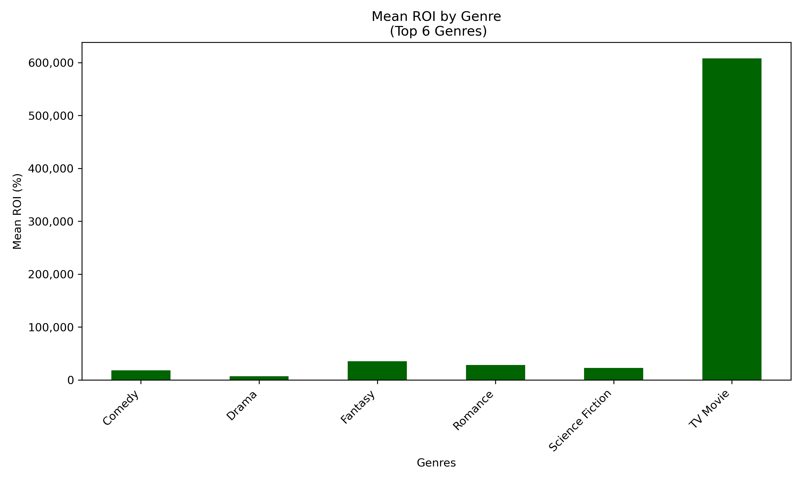

# AI Project 2 Group 10
A data analysis class project for Columbia University's AI bootcamp.

## Reel Returns: Machine Learning Insights into Movie Profitability

    

## Project Team Members:
* Eric Alicea
* Kalvin Anglin
* Vadim Bychok
* Peta-Gaye McKenzie
* Odele Pax
* Funda Subasi

## Table of Contents

* [Abstract](#Abstract)
* [Data](#Data)
* [Methods](#Methods)
* [Limitations](#Limitations)
* [Conclusions](#Conclusions)
* [References/Footnotes](#References/Footnotes)

## Abstract

* Objective: To build a reliable predictive model to help industry stakeholders make an informed decision regarding movie investments and releases. This project aims to explore the relationship between consumer spending, inflation, unemployment and the performance of movies released in the US from 1981 - 2023 using machine learning techniques and analysis of key features such as, budget, genres,ratings, and economic indicators. 

* **Thesis/Hypothesis**: There is a correlation between the ratings and ROI of movies released in the US and the country's economic climate from 1981 - 2023. This is based on correlations between economic periods of bust and boom, and how movie ticket sales coincided with consumers’ spending habits, inflation, and unemployment. 
    * Considerations: Are movies more profitable in a depressed economy? Are movies recessionproof? Are people more inclined to spend money for movies during hard economic times? What kind of features have more weight in predicting a movie's success based on ratings, ROI and key economic indicators?

---

## Data

We reviewed datasets that provided the most opportunity for a thorough exploration of our key questions:

**Movies**
* Movies Dataset: 
https://www.kaggle.com/datasets/alanvourch/tmdb-movies-daily-updates?select=TMDB_all_movies.csv

**Economic Indicator**

* Umemployment Dataset:
https://www.epi.org/data/#?subject=unemp

* Consumer Confidence Indicator:
https://www.kaggle.com/datasets/iqbalsyahakbar/cci-oecd

* Public Debt:
https://www.kaggle.com/datasets/pavankrishnanarne/us-public-debt-quarterly-data-1996-present

---

## Project Management
|  Phases | Details|
| :--- | :--- |
| Data Fetching  | Google searches, Kaggle, EPI Data Library, Census API search    |
| Software Version Control | Repository created on GitHub, GitHub Projects used to create and track tasks based on key questions, Git branch used to upload files to from local computer to remote repository, utilized "compare & pull requests" to compare branch changes before merging into the main branch correlation, comparison, summary statistics, sentiment analysis, and time series analysis   |
| EDA | Imported CSV files, created dataframes, utlized pandas and python functions to search, select and handle missing data movies and economoic dataset, identified keys features , experience levels, skills, and employment trends for further analysis    |
| Preprocessing  |  Utilized dictionarys, list, loops, column slicing, string manipulation, and train-test split to prevent data leakage and ensure high quality and structured data is visualized and fed into the models for linear regression predictions and classification   |
| Modeling & Tuning |  Utilized dictionarys, list, loops, column slicing, string manipulation, to ensure high quality and structured data is visualized and fed into the models for linear regression predictions and classification   |

---
## Methods
### Movie EDA & Preprocessing
* Numerous factors contribue to the successes and failures within the film industry, both on critical and financial scales. Using a simplified view to focus on more generalized classifications, as well as to meet the         puposes of our modelling, several contributing factors were chosen to highlight and predict each scale of success within our selected dataset. The features ultimately chosen were:
  * Vote Average (a given movie's rating from zero (0) to ten (10))
  * Vote Count
  * Revenue (total earnings in USD for a given movie)
  * Runtime
  * Budget (total expenses in USD to produce and promote a given movie)
  * Title
  * Original Title
  * Genres
  * Production Companies
* To create our `critical_success` indicator - a classification as to how well recieved a title was by fans and critics - we focused on the `vote_average` or `ratings` feature to create guidelines for ranges of scores. With a rating scale of zero (0) to ten (10), ranges were established to break a given movie's critical success down by the following scale:
  * **0 to 2.5**: `panned`
  * **2.5 to 5**: `alright`
  * **5 to 7.5**: `well liked`
  * **7.5 to 10**: `critical success`
* To engineer a `financial_success` indicator - a measure of what level of returns a title produced - we calculated the `ROI` as follows:
  > ((`revenue`-`budget`)/`budget`) * 100
  * The resulting value was compared to industry standard breakpoints to describe the folling classifications: 
    * **Less than 0%**: `failure`
    * **Exactly 0%**: `broke even`
    * **Between 0% and 50%**: `modest returns`
    * **Between 50% and 100%**: `moderate returns`
    * **Between 100% and 500%**: `excellent returns`
    * **Over 500%**: `extraordinary returns`
    * *Note: For the purposes of our modeling, only records with a `budget` NOT equal to zero (0) were retained*
    
### Economic EDA & Preprocessing
* To serve the purposes of our modeling, the following three factors were chosen to highlight the economic status at a given movie's release date:
  * Consumer Confidence Indicator (CCI)
  * Consumer Price Index (CPI)
  * Unemployment Rate

* These data features provided adequate answers to following three questions:
  * How likely are people to be spending money?
  * How much do things cost when they do spend money?
  * How many people have jobs to earn money to spend?
 
* The for features were provided as monthly measures over several decades. To create our `Economic Climate` indicator - a classification as to whether or not the economics of a given time were on the better side for         consumers - we calculated a rolling 12-month percent change in the mean of those monthly values in order to show if a given feature was on a positive or negative trend for the provided period.
  * CCI is an indication of developments for future households' consumption and saving based on expected financial situation, sentiment regarding the general economic situation, employment status, and capacity for         savings:
      * An indicator above `100` indicates an optimistic outlook and a greater likliehood to spend money over cautious saving
      * An indicator below `100` indicates a pessimistic outlook and both a higher likeliehood to save money and a lower tendency to consume
  * CPI is a critical economic indicator for measuring the purchasing power of money over time, measuring the average change over time in the prices paid by urban consumers for goods and services
      * The CPI is the value at the end of the respective month
  * Unemployment is the share of the labor force wihout a job
        * Monthly percentages calculated as a rolling 12-month average (mean)

* Economic Climate - Having calculated the rolling 12-month percent change for each feature - based off the rolling 12-month mean - we identified positive or negative change in values and flag the movement accordingly. From there, we made the following simple statements
  * For **CCI**, a positive change is "good", as it indicates an increase in the likelihood of consumers to spend money
  * For **CPI**, a negative change is "good", as it indicates a decrease in the costs for goods and services
  * For **Unemployment Rate**, a negative change is "good", as it indicates an incrase in the population active in the workforce

* Interpretation: we can interpret movement contrary to those changes as "bad". With this simplified view of the features, we can draw a classification as follows*     
  * If **at least two (2) features** have a "good" value, we can set `Economic Climate` to `Comfortable to Good`
  * If **at least two (2) features** have a "bad" value, we can set `Economic Climate` to `Lean to Bad`
  * *This was used to gauge whether the ecnomic state at a given rlease date supports or disproves our hypothesis.*
 
### Combining Data, Target Engineering, & Feature Selection
* A combined dataset was created for modeling based off the `df_movies` and `df_economics`. The `df_movies` dataset was set to a `Date` index, and the year and month were extracted from the `Date` of the `df_economics` dataset

* The target variable in the dataset was created by concatenating the two engineered target values from the `df_movies` dataset with the engineered target from the `df_economics` dataset

* Feature Selection inclued dropping uneeded features, removing `NaN` records, analyzing feature correlation and selecting the `Genres` column for aggregate analysis.

    
    
Correlation Matrix

### Genre Aggregation
* Given the absence of strong correlations based on the correlation matrix, further exploration through visualizations was beneficial observe any interesting connections between genres and economic climate. When selecting the subset for plotting, aggregations were based on the `mean()` of `roi` and `sum()` of `revenue()` grouped by `genres`, `Economic Climate`, and then both.

    
    
Mean_ROI_by_Ecnomoic_Climate

    
    
Mean_ROI_by_Ecnomoic_Climate

* `mean()` of `roi` grouped by `genres`

    
    
Mean_ROI_by_Genre_Top_6

    
    
Mean_ROI_by_Genre_Top_6

    
    
Mean_ROI_by_Genre_Top_6

* `mean()` of `roi` grouped by `Economic Climate` and  `genres`

    
    
Mean_ROI_by_Genre_Top_6

* `sum()` of `revenue` grouped by `genres`

* `sum()` of `revenue` grouped by `Economic Climate` and  `genres`

### Model Selections
* Linear Regression vs Logistic Regression 
  * Linear Regression is a method used in machine learning to predict a continuous outcome based on one or more input features. It works by finding the best-fit line that represents the relationship between the inputs and the output. This line is determined so that it minimizes the difference between the actual and predicted values. Essentially, Linear Regression helps in understanding and modeling how changes in the input variables affect the output variable, providing a straightforward way to make predictions.
  * Logistic Regression is a machine learning algorithm used for binary classification tasks, where the goal is to predict one of two possible outcomes. Unlike Linear Regression, which predicts continuous values, Logistic Regression predicts the probability that a given input belongs to a certain class. It works by applying a logistic function (also known as the sigmoid function) to the linear combination of input features. This function maps the output to a value between 0 and 1, which can be interpreted as a probability. Based on this probability, the final classification decision is made, typically by setting a threshold (e.g., 0.5) to determine the class. Logistic Regression is widely used because of its simplicity, efficiency, and effectiveness for binary classification problems.

* Classifier Models
  * K-Nearest Neighbor (KNN) is a straightforward algorithm used for classification and regression. It makes predictions by finding the k closest training examples to the new input and using their values. For classification, it assigns the most frequent class among the neighbors; for regression, it averages their values. KNN is easy to implement but can be slow with large datasets due to the need to compute distances for each prediction.
  * Random Forest is an ensemble learning method used for classification and regression tasks. It works by creating multiple decision trees during training and merging their results to improve accuracy and control overfitting. Each tree in the forest is built from a random subset of the training data and features, making the model more robust and less sensitive to noise. Predictions are made by averaging the results (regression) or taking a majority vote (classification) from all the trees. Random Forest is popular for its high accuracy, versatility, and ability to handle large datasets with many features.
  * AdaBoost is an ensemble learning method that boosts the performance of weak classifiers by combining them. It works iteratively, training weak classifiers and adjusting weights to focus on misclassified points. The final model is a weighted sum of these classifiers, improving accuracy and reducing bias and variance.
  * Decision Tree is a machine learning algorithm used for classification and regression. It splits data based on feature values to create a tree-like structure of decisions and outcomes. Each split is based on criteria like Gini impurity or information gain. The process continues until a stopping condition is met. Decision Trees are easy to interpret but can overfit without proper pruning.

---
## Results
* Linear Regression

Selection of this model was based on relationship between the numerical response and one or more variables that explain the response. The numerical response or target variable we chose was ROI, however it only achieved an R2 score = -.087. While the MSE value is relatively small, R2 score is the statistical measure representing how well the model fits the data. A slightly negative R2 score suggests  our model is not fitting the data and performing worse than simply using the mean of the ROI as a prediction. The results of this model guide our selection of subsequent models better equipped for handling classification predictions and nonlinear patterns and trends.

* Logistic Regression
  
This model was chosen to explore the classification of discrete variables. We featured engineered a target variable the contained difference classes of movie's success based on Raings, ROI, and certain economic indicators. As a statistical method for predicting binary outcomes, the Logistic Regression model achieved an accuracy score = .78 and precision score = .79 when it came to predicting the classification of target variable. Similar to Linear Regression, Logistic Regression is based on a linear relationship but different given it is between the the independent variable and the log-odds or probablity score between 0 and 1 for classification within the dependent variable. The scores for this model demonstrated it's ability to handle categorical outcomes effectively on large sample sizes. Larger dataset are recommended for Logistic regression models it provides better stability, reliability, and generalizability of the models estimates. A key drawback being this model's sensitivity to imbalanced classes in our dataset leading to biased predictions.

* K-Nearest Neighbor (KNN)
  
In implementing the KNN to compare data points to determine the classfication of our target variable, we utilized a several variations of the model. First, we tested an untuned model which achieved an accuracy score of .65 and and a precision score of .62. Next, we tested the untuned model using PCA to reduce the dimensionality of the data, however the untuned model yielded an even lower accuracy score = .62 and a precision score = .59. To the tune the KNN classfier, we had the model loop through different k-values to find wich had the highest accuracy. The optimal k-value was 23, which yielded an similar accuracy score = .65 and slightly lower precision score =.60. Lastly, we hyperparameter tuned the KNN classifier using `GridSearchCV model` which yield k-value equal to 1 with the lowest accuracy score of .58. The lower scores of this model can attributed to the "Curse of Dimensionality" with causes the algorithm to perform poorly with high-dimensional data due to the distances between data points becoming less meaningful.

* Random Forest 
  
The accuracy and precision scores of the Logistic Regression model indicate the Random Forest model should be tested due to it being robust to outliers and nonlinear data. Random Forest utilized a bagging technique by training multiple models independently and then combining their predictions into a final predictions. This model achieved an accuracy = .80 and precision = .83 illustrating it's success with large datasets and handling thousand of input variables by ranking importance in a natural way.

* AdaBoost

We selected AdaBoost to test another ensemble learning model, but instead evaluate the boosting method. Boosting is technique where a strong learning model is created by increasing the weights of samples misclassified by multiple weak learner so the get more get more attention in the subsequent iterations. We tested this model, intially designed for binary classification on high dimensional dataset test is the "Sensitivity to Noisy Data" and achieved an accuracy = .37 and precision = .17. This scores were attributed to the models technique of increasing the weight of misclassification, while not accounting for those misclassifications being caused by noisy dataset.

* Decision Tree

  Testing out the Decision Tree model provided a basis for how a flowchart-like algorithm would perform on our dataset. The model used nodes to split the data into subsets based on the most significant features, and repeated this process until reaching a certain stopping criterion like maximum depth or minimum samples. We achieved an accuracy and precision score = .99,illustrating another models sensitivity to a dataset set with imbalanced classes. As a result this models scores were most likely attributable to the model's tendency to make predictions towards a dominant class.
___
## Future Considerations

* Gather more diverse economic data, and engage with an economist to interpret the data.
* Feature Selection and additional analysis to determine how the weights of the different features affect the ROI and could improve the model scores
* **Lingering Questions**
    * **Datasets:** Assumption "Revenue" feature in the TMDB Movies Dataset included streaming. Assumption "CCI, CPI, & Unemployment" are appropriate metrics for economic climate.

## Conclusion

* Our linear regression analysis of the movie industry between the years of 1981 and 2023, based on the relationship between a continuous dependent variable and key independent features in the dataset resulted in the conclusion that there was no clear correlation between a movie's ROI (the continuous dependent variable) and the following key independent features: consumer confidence index (CCI), consumer price index (CPI), and unemployment rate (UR). This was further supported by a Linear Regression R2 score = -.0086.

* Although no strong correlation seems to exist among the features used to create our `Success Conditions or Indicators`, visualizations do indicate there are certain genres that perform drastically better in a `Lean to Bad` `Economic Climate`. Ultimately our hypothesis may be null, but our EDA and modeling proved well enough that further investigation may uncover more concrete findings.

* Our predictive classification analysis of the movie industry during the same window of time, but based on the categorization of a movie's Success Conditions resulted in a Random Forest accuracy = .80 and precision = .83. The classes or conditions of success created by combining movie ratings, ROI, CCI, CPI, & UR provided an economic snapshot of a movie's performance. This snapshot provides valuable insight for investors and movie producer when determing the optimal time for a movie release.

Based on our modelling, `LinearRegression()` and `AdaBoostClassifier` showed the poorest overall performance, while `DecisionTreeClassifier()` seemed to be overfitted to an extreme degree. Overall, `RandomForestClassifier()` showed the most promise for accurate and precise predictions for our `Success Indicator`.

## Citations & Licenses
### Citations
#### **Unemployment.csv**

Economic Policy Institute, *State of Working America Data Library*, “Unemployment”, 2024

### Licenses
#### **TMBD_all_movies.csv**

Copyright 2024 __[Alan Vourc'h](https://www.kaggle.com/alanvourch)__

Licensed under the Apache License, Version 2.0 (the "License");
You may not use this file except in compliance with the License. You may obtain a copy of the License at

> __http://www.apache.org/licenses/LICENSE-2.0__

Unless required by applicable law or agreed to in writing, software distributed under the License is distributed on an "AS IS" BASIS, WITHOUT WARRANTIES OR CONDITIONS OF ANY KIND, either express or implied. See the License for the specific language governing permissions and limitations under the License.

#### **CCI_OECD.csv** and **US_inflation_rates.csv**

CCO: Public Domain
